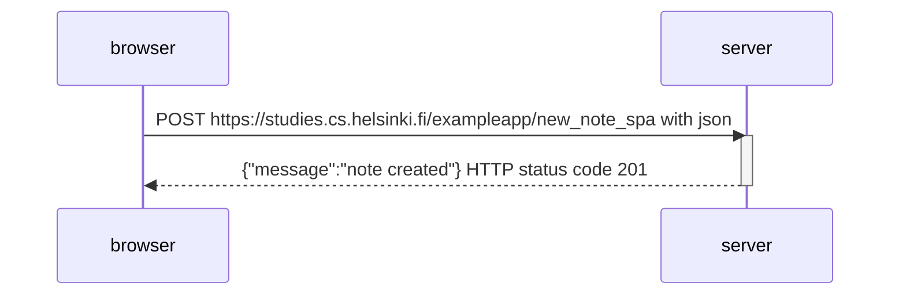

```mermaid
sequenceDiagram
    participant browser
    participant server

    browser->>server: POST https://studies.cs.helsinki.fi/exampleapp/new_note_spa with json
    activate server
    server-->>browser: {"message":"note created"} HTTP status code 201
    deactivate server
```
