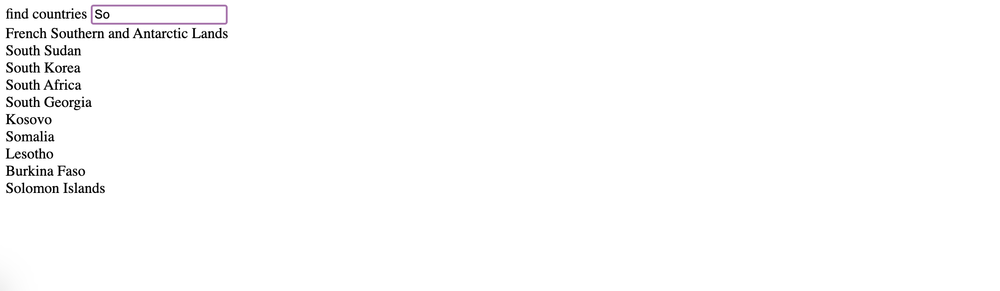
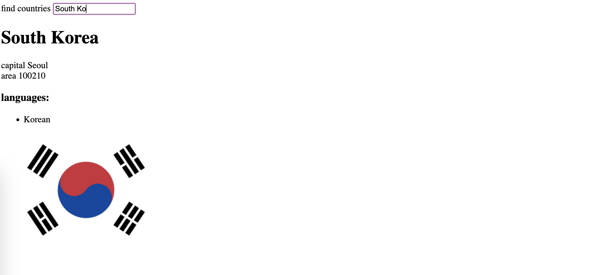

## Title

Data for countries

## Description

Fullstack Open exercises 2.18 to 2.20.

## Images

## Concepts Practiced

- React Components
- Passing Props to a Component
- Javascript in JSX with curly braces
- Javascript objects
- React's state hook
- Asynchronous update of state
- Event Handling
- React useEffect hook
- Fetch and handle data from a countries REST api
- conditional rendering
