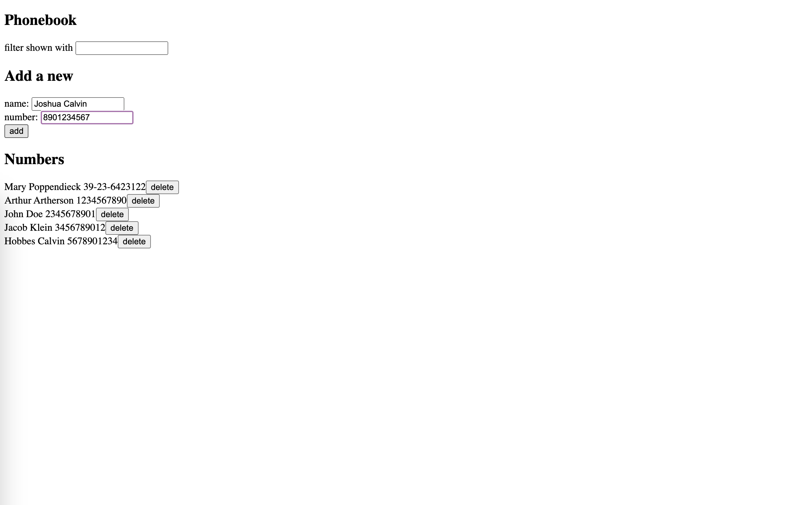

## Title

Phonebook App

## Description

Fullstack Open exercises 2.6 to 2.17.

## Images

## Concepts Practiced

- React Components
- Passing Props to a Component
- Javascript in JSX with curly braces
- Javascript objects
- React's state hook
- Asynchronous update of state
- Event Handling
- React useEffect hook
- HTML forms
- Fetch and handle data stored in backend server
- CSS styling

## Notes
